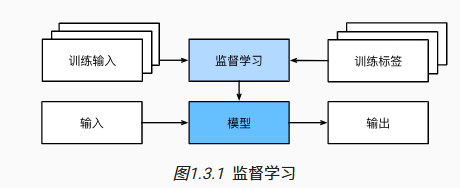
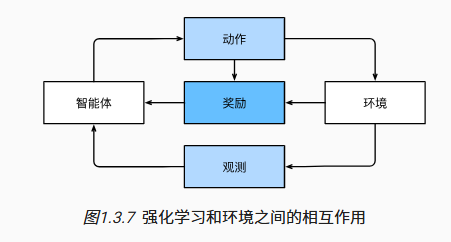
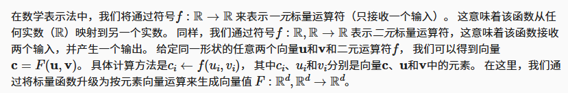

# 深度学习笔记

## 符号

### 字体

**正常**

$x$

$X$

**Bbb**

$\Bbb{x}$

$\Bbb{X}$

**mathbb**

$\mathbb{x}$

$\mathbb{X}$

**mathbf**

$\mathbf{x}$

$\mathbf{X}$

**mathtt**

$\mathtt{x}$

$\mathtt{X}$

**mathrm**

$\mathrm{x}$

$\mathrm{X}$

**mathsf**

$\mathsf{x}$

$\mathsf{X}$

**mathcal**

$\mathcal{x}$

$\mathcal{X}$

**mathscr**
$\mathscr{x}$

$\mathscr{X}$

**mathfrak**

$\mathfrak{x}$

$\mathfrak{X}$

### 数字

标量 $x$ 

向量 $\mathbf{x}$

矩阵 $\mathbf{X}$

张量 $\mathsf{X}$

单位矩阵  $\mathbf{I}$

### 集合

集合 $\mathcal{X}$

整数集合 $\mathbb{Z}$

实数集合 $\mathbb{R}, \mathbb{R}^n, \mathbb{R}^{a \times b}$

### 函数和运算符

按元素相乘 $\odot$

集合的基数 $|\mathcal{X}|$

$L_p$正则 $\Vert \cdot \Vert_p$

$L_2$正则 $\Vert \cdot \Vert$

向量点积 $\langle \mathbf{x}, \mathbf{y} \rangle$

定义 $\triangleq$

### 微积分

导数 $\text{d}$

偏导 $\partial$

梯度 $\nabla$

积分 $\int$

### 概率论与信息论

随机变量$z$具有概率分布$P$ $z$~$P$

变量独立 $X \bot Y$

方差 $\text{Var}$

随机变量的相关性 $\rho(X, Y)$

熵 $H$

$P$和$Q$的KL-散度 $D_{KL}(P \Vert Q)$

## 引言

 任一调整参数后的程序被称为*模型*（model）。 通过操作参数而生成的所有不同程序（输入-输出映射）的集合称为“模型族”。 使用数据集来选择参数的元程序被称为*学习算法*（learning algorithm）。

### 机器学习中的关键组件

无论什么类型的机器学习问题，都会遇到这些组件：

1. 可以用来学习的*数据*（data）；
2. 如何转换数据的*模型*（model）；
3. 一个*目标函数*（objective function），用来量化模型的有效性；
4. 调整模型参数以优化目标函数的*算法*（algorithm）。

 #### 数据

 每个数据集由一个个*样本*（example, sample）组成，大多时候，它们遵循独立同分布(independently and identically distributed, i.i.d.)。 样本有时也叫做*数据点*（data point）或者*数据实例*（data instance），通常每个样本由一组称为*特征*（features，或*协变量*（covariates））的属性组成。 机器学习模型会根据这些属性进行预测。 在上面的监督学习问题中，要预测的是一个特殊的属性，它被称为*标签*（label，或*目标*（target））。

当每个样本的特征类别数量都是相同的时候，其特征向量是固定长度的，这个长度被称为数据的*维数*（dimensionality）。 

 与传统机器学习方法相比，深度学习的一个主要优势是可以处理不同长度的数据。

#### 目标函数

 我们通常定义一个目标函数，并希望优化它到最低点。 因为越低越好，所以这些函数有时被称为*损失函数*（loss function，或cost function）。

 在一个数据集上，我们可以通过最小化总损失来学习模型参数的最佳值。 该数据集由一些为训练而收集的样本组成，称为*训练数据集*（training dataset，或称为*训练集*（training set））。 然而，在训练数据上表现良好的模型，并不一定在“新数据集”上有同样的性能，这里的“新数据集”通常称为*测试数据集*（test dataset，或称为*测试集*（test set））。

#### 优化算法

 深度学习中，大多流行的优化算法通常基于一种基本方法–*梯度下降*（gradient descent）。 简而言之，在每个步骤中，梯度下降法都会检查每个参数，看看如果仅对该参数进行少量变动，训练集损失会朝哪个方向移动。  然后，它在可以减少损失的方向上优化参数。

### 机器学习问题

#### 监督学习

*监督学习*（supervised learning）擅长在“给定输入特征”的情况下预测标签。 每个“特征-标签”对都称为一个*样本*（example）。 

目标是生成一个模型，能够将任何输入特征映射到标签（即预测）。

用概率论术语来说，我们希望预测“估计给定输入特征的标签”的条件概率。 

监督学习的==学习过程==一般可以分为三大步骤：

1. 从已知大量数据样本中随机选取一个子集，为每个样本获取真实标签。这些输入和相应的标签一起构成了训练数据集；
2. 选择有监督的学习算法，它将训练数据集作为输入，并输出一个“已完成学习的模型”；
3. 将之前没有见过的样本特征放到这个“已完成学习的模型”中，使用模型的输出作为相应标签的预测。



 ##### 回归

*回归*（regression）是最简单的监督学习任务之一。当标签取任意数值时，我们称之为*回归*问题，此时的目标是生成一个模型，使它的预测非常接近实际标签值。

判断回归问题的一个很好的经验法则是，任何有关“有多少”的问题很可能就是回归问题。比如：

- 这个手术需要多少小时；
- 在未来6小时，这个镇会有多少降雨量。

##### 分类

 这种“哪一个”的问题叫做*分类*（classification）问题。 *分类*问题希望模型能够预测样本属于哪个*类别*（category，正式称为*类*（class））。

 给定一个样本特征，模型为每个可能的类分配一个概率。

预测类别的概率的大小传达了一种模型的不确定性。

分类问题的常见损失函数被称为*交叉熵*（cross-entropy）。

当不确定风险的影响远远大于收益。 因此，我们需要将“预期风险”作为损失函数，即需要将结果的概率乘以与之相关的收益（或伤害）。

有一些分类任务的变体可以用于寻找层次结构，层次结构假定在许多类之间存在某种关系，这通常被称为*层次分类*(hierarchical classification)。

##### 标记问题

学习预测不相互排斥的类别的问题称为*多标签分类*（multi-label classification）。

##### 搜索

有时，我们不仅仅希望输出一个类别或一个实值。 在信息检索领域，我们希望对一组项目进行排序。

 搜索结果的排序也十分重要，学习算法需要输出有序的元素子集。

##### 推荐系统

*推荐系统*（recommender system），它的目标是向特定用户进行“个性化”推荐。 

在某些应用中，客户会提供明确反馈，表达他们对特定产品的喜爱程度。 例如，亚马逊上的产品评级和评论。 在其他一些情况下，客户会提供隐性反馈。 例如，某用户跳过播放列表中的某些歌曲，这可能说明这些歌曲对此用户不大合适。 推荐系统会为“给定用户和物品”的匹配性打分，这个“分数”可能是估计的评级或购买的概率。 由此，对于任何给定的用户，推荐系统都可以检索得分最高的对象集，然后将其推荐给用户。

##### 序列学习

如果输入是连续的，模型可能就需要拥有“记忆”功能。

 序列学习需要摄取输入序列或预测输出序列，或两者兼而有之。 具体来说，输入和输出都是可变长度的序列。

1. 标记和解析
2. 自动语音识别
3. 文本到语音
4. 机器翻译

#### 无监督学习

数据中不含有“目标”的机器学习问题通常被为*无监督学习*（unsupervised learning）

- *聚类*（clustering）问题：没有标签的情况下，给数据分类
- *主成分分析*（principal component analysis）问题：找到少量的参数来准确地捕捉数据的线性相关属性
- *因果关系*（causality）和*概率图模型*（probabilistic graphical models）问题：描述观察到的许多数据的根本原因
- *生成对抗性网络*（generative adversarial networks）：为我们提供一种合成数据的方法，甚至像图像和音频这样复杂的非结构化数据。潜在的统计机制是检查真实和虚假数据是否相同的测试，它是无监督学习的另一个重要而令人兴奋的领域。

#### 与环境互动

在算法与环境断开后进行的学习，被称为*离线学习*（offline learning）。

#### 强化学习

在强化学习问题中，智能体（agent）在一系列的时间步骤上与环境交互。 在每个特定时间点，智能体从环境接收一些*观察*（observation），并且必须选择一个*动作*（action），然后通过某种机制（有时称为执行器）将其传输回环境，最后智能体从环境中获得*奖励*（reward）。

强化学习的目标是产生一个好的*策略*（policy）。强化学习智能体选择的“动作”受策略控制，即一个从环境观察映射到行动的功能。



强化学习框架的通用性十分强大。 例如，我们可以将任何监督学习问题转化为强化学习问题。 

当然，强化学习还可以解决许多监督学习无法解决的问题。 在强化学习中，我们并不假设环境告诉智能体每个观测的最优动作。 一般来说，智能体只是得到一些奖励。 此外，环境甚至可能不会告诉是哪些行为导致了奖励。强化学习者必须处理*学分分配*（credit assignment）问题：决定哪些行为是值得奖励的，哪些行为是需要惩罚的。

 强化学习智能体必须不断地做出选择：是应该利用当前最好的策略，还是探索新的策略空间（放弃一些短期回报来换取知识）。

智能体的动作会影响后续的观察，而奖励只与所选的动作相对应。 环境可以是完整观察到的，也可以是部分观察到的。

当环境可被完全观察到时，强化学习问题被称为*马尔可夫决策过程*（markov decision process）。 当状态不依赖于之前的操作时，我们称该问题为*上下文赌博机*（contextual bandit problem）。 当没有状态，只有一组最初未知回报的可用动作时，这个问题就是经典的*多臂赌博机*（multi-armed bandit problem）。

### 起源

*神经网络*（neural networks）的得名源于生物灵感。 其核心是当今大多数网络中都可以找到的几个关键原则：

- 线性和非线性处理单元的交替，通常称为*层*（layers）；
- 使用链式规则（也称为*反向传播*（backpropagation））一次性调整网络中的全部参数。

## 数据操作

$n$维数组，也称为*张量*（tensor）。

### 入门

张量表示一个由数值组成的数组，这个数组可能有多个维度。 具有一个轴的张量对应数学上的*向量*（vector）； 具有两个轴的张量对应数学上的*矩阵*（matrix）； 具有两个轴以上的张量没有特殊的数学名称。

张量中的每个值都称为张量的 *元素*（element）。

可以通过张量的`shape`属性来访问张量（沿每个轴的长度）的*形状* 。

想知道张量中元素的总数，即形状的所有元素乘积，可以检查它的大小（size）。 

要想改变一个张量的形状而不改变元素数量和元素值，可以调用`reshape`函数。我们不需要通过手动指定每个维度来改变形状。我们可以通过`-1`来调用此自动计算出维度的功能。 即我们可以用`x.reshape(-1,4)`或`x.reshape(3,-1)`来取代`x.reshape(3,4)`。

 我们可以创建一个形状为（2,3,4）的张量，其中所有元素都设置为0。代码如下：

```python
torch.zeros((2, 3, 4))
```

同样，我们可以创建一个形状为`(2,3,4)`的张量，其中所有元素都设置为1。代码如下：

```python
torch.ones((2, 3, 4))
```

 以下代码创建一个形状为（3,4）的张量。 其中的每个元素都从均值为0、标准差为1的标准高斯分布（正态分布）中随机采样。

```python
torch.randn(3, 4)
```

```python
tensor([[-0.0135,  0.0665,  0.0912,  0.3212],
        [ 1.4653,  0.1843, -1.6995, -0.3036],
        [ 1.7646,  1.0450,  0.2457, -0.7732]])
```

我们还可以通过提供包含数值的Python列表（或嵌套列表），来为所需张量中的每个元素赋予确定值。 在这里，最外层的列表对应于轴0，内层的列表对应于轴1。

```python
torch.tensor([[2, 1, 4, 3], [1, 2, 3, 4], [4, 3, 2, 1]])
```

```python
tensor([[2, 1, 4, 3],
        [1, 2, 3, 4],
        [4, 3, 2, 1]])
```

### 运算符

最简单且最有用的操作是*按元素*（elementwise）运算。 



```python
x = torch.tensor([1.0, 2, 4, 8])
y = torch.tensor([2, 2, 2, 2])
x + y, x - y, x * y, x / y, x ** y  # **运算符是求幂运算
```

“按元素”方式可以应用更多的计算，包括像求幂这样的一元运算符。

```python
torch.exp(x)
```

我们也可以把多个张量*连结*（concatenate）在一起， 把它们端对端地叠起来形成一个更大的张量。

```python
X = torch.arange(12, dtype=torch.float32).reshape((3,4))
Y = torch.tensor([[2.0, 1, 4, 3], [1, 2, 3, 4], [4, 3, 2, 1]])
torch.cat((X, Y), dim=0), torch.cat((X, Y), dim=1)
```

```python
(tensor([[ 0.,  1.,  2.,  3.],
         [ 4.,  5.,  6.,  7.],
         [ 8.,  9., 10., 11.],
         [ 2.,  1.,  4.,  3.],
         [ 1.,  2.,  3.,  4.],
         [ 4.,  3.,  2.,  1.]]),
 tensor([[ 0.,  1.,  2.,  3.,  2.,  1.,  4.,  3.],
         [ 4.,  5.,  6.,  7.,  1.,  2.,  3.,  4.],
         [ 8.,  9., 10., 11.,  4.,  3.,  2.,  1.]]))
```

有时，我们想通过*逻辑运算符*构建二元张量。

```python
X == Y
```

```python
tensor([[False,  True, False,  True],
        [False, False, False, False],
        [False, False, False, False]])
```

对张量中的所有元素进行求和，会产生一个单元素张量。

```python
X.sum()
```

```python
tensor(66.)
```
